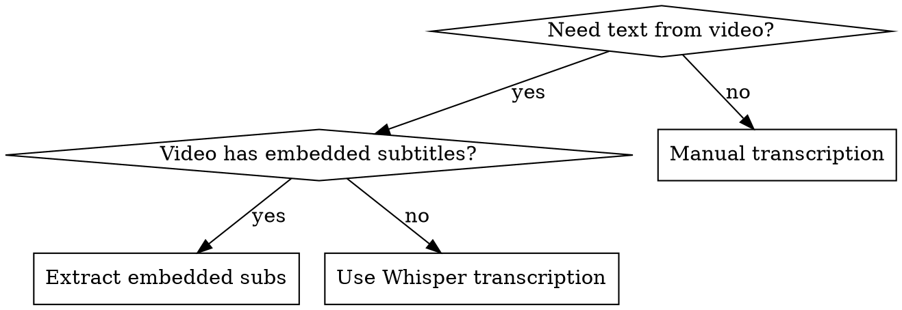

# Video Subtitle Extractor

## Overview

提取本地视频文件中的英文字幕和台词信息的技术指南。核心原理：使用 Whisper AI 模型进行语音识别，将视频音频转录为带时间戳的字幕文本。

## When to Use



**Use when:**
- Extracting dialogue from English movies/videos
- Creating transcripts from educational videos
- Converting video speeches to text format
- Generating subtitles for captioning
- Analyzing video content through text

**When NOT to use:**
- Video already has text transcript available
- Non-English content (Whisper supports multi-lingual but this skill focuses on English)
- Real-time transcription requirements

## Core Pattern

### Before: Manual Process
```bash
# User watches video and types everything manually
# Time-consuming, error-prone, no timestamps
```

### After: Automated Extraction
```python
# One command extracts everything with timestamps
extract_subtitles("movie.mp4")  # → clean transcript with timestamps
```

## Quick Reference

| Scenario | Method | Tools |
|----------|--------|-------|
| Embedded subtitles in video | Extract directly | ffmpeg, CCExtractor |
| No subtitles (audio only) | Speech-to-text | Whisper AI |
| DVD/Blu-ray sources | Extract from disc | HandBrake, MakeMKV |
| Multiple subtitle tracks | Choose language track | ffmpeg |

## Implementation

### Method 1: Whisper Transcription (Recommended for most videos)

**Install dependencies:**
```bash
pip install openai-whisper
pip install ffmpeg-python  # Required for audio processing
```

**Basic extraction script:**
```python
import whisper
import json
from datetime import timedelta

def extract_subtitles(video_path, output_format="txt"):
    """
    Extract English subtitles from video using Whisper.

    Args:
        video_path: Path to video file
        output_format: "txt", "json", or "srt"

    Returns:
        Transcribed text with timestamps
    """
    # Load model (sizes: tiny, base, small, medium, large)
    model = whisper.load_model("base")

    # Transcribe with language specified for better accuracy
    result = model.transcribe(
        video_path,
        language="en",  # English only
        task="transcribe",
        word_timestamps=True  # Include word-level timing
    )

    if output_format == "json":
        return json.dumps(result, indent=2)

    elif output_format == "srt":
        return generate_srt(result["segments"])

    else:  # txt format (default)
        return format_text_transcript(result)

def format_text_transcript(result):
    """Format as readable transcript with timestamps."""
    output = []
    for segment in result["segments"]:
        start = str(timedelta(seconds=int(segment["start"])))
        text = segment["text"].strip()
        output.append(f"[{start}] {text}")
    return "\n".join(output)

def generate_srt(segments):
    """Generate SRT subtitle format."""
    srt_content = []
    for i, segment in enumerate(segments, 1):
        start_time = format_srt_time(segment["start"])
        end_time = format_srt_time(segment["end"])
        srt_content.append(f"{i}\n{start_time} --> {end_time}\n{segment['text'].strip()}\n")
    return "\n".join(srt_content)

def format_srt_time(seconds):
    """Convert seconds to SRT time format."""
    hours = int(seconds // 3600)
    minutes = int((seconds % 3600) // 60)
    secs = int(seconds % 60)
    millis = int((seconds % 1) * 1000)
    return f"{hours:02}:{minutes:02}:{secs:02},{millis:03}"

# Usage example
if __name__ == "__main__":
    transcript = extract_subtitles("movie.mp4", output_format="txt")
    print(transcript)

    # Save to file
    with open("subtitles.txt", "w", encoding="utf-8") as f:
        f.write(transcript)
```

### Method 2: Extract Embedded Subtitles

**Using ffmpeg for existing subtitle tracks:**
```bash
# List available subtitle tracks
ffmpeg -i video.mp4 2>&1 | grep Stream | grep Subtitle

# Extract first subtitle track to SRT
ffmpeg -i video.mp4 -map 0:s:0 subtitles.srt

# Extract specific language subtitle
ffmpeg -i video.mp4 -map 0:s:m:language:eng english_subs.srt
```

**Python wrapper for embedded subtitles:**
```python
import subprocess

def extract_embedded_subtitles(video_path, output_srt, track_index=0):
    """
    Extract embedded subtitle track from video file.

    Args:
        video_path: Input video file path
        output_srt: Output SRT file path
        track_index: Which subtitle track to extract (0-based)
    """
    cmd = [
        "ffmpeg",
        "-i", video_path,
        "-map", f"0:s:{track_index}",
        "-c:s", "srt",
        output_srt
    ]

    subprocess.run(cmd, check=True)
    return output_srt
```

### Model Size Selection

| Model | Size | Speed | Accuracy | Best For |
|-------|------|-------|----------|----------|
| tiny | ~39MB | Fastest | Lower | Quick drafts |
| base | ~74MB | Fast | Good | **Default choice** |
| small | ~244MB | Medium | Better | Better accuracy |
| medium | ~769MB | Slow | Very Good | Important content |
| large | ~1550MB | Slowest | Best | Final transcripts |

## Common Mistakes

### Mistake 1: Not Specifying Language
```python
# Bad - auto-detect can misidentify
result = model.transcribe(video_path)

# Good - explicit English for better accuracy
result = model.transcribe(video_path, language="en")
```

### Mistake 2: Wrong Model Choice
```python
# Bad - using large model for test run (too slow)
model = whisper.load_model("large")

# Good - use base for testing, scale up as needed
model = whisper.load_model("base")
```

### Mistake 3: Missing FFmpeg
```bash
# Error: RuntimeError: Failed to load audio
# Fix: Install ffmpeg first
sudo apt install ffmpeg  # Linux
brew install ffmpeg      # macOS
# Download from ffmpeg.org for Windows
```

## Real-World Impact

- **Movies:** 2-hour film transcribed in ~30 minutes with base model
- **Accuracy:** Whisper base achieves ~90% word accuracy on clear English speech
- **Time savings:** Automated vs manual: 30 minutes vs 6+ hours
- **Cost:** Free (local processing) vs paid services

## Output Formats

### Plain Text Format
```
[0:00:15] Hello, welcome to the show.
[0:00:18] Today we're discussing AI technology.
[0:00:22] Let's get started.
```

### SRT Format
```
1
00:00:15,000 --> 00:00:18,500
Hello, welcome to the show.

2
00:00:18,500 --> 00:00:22,000
Today we're discussing AI technology.
```

### JSON Format
```json
{
  "segments": [
    {
      "start": 15.0,
      "end": 18.5,
      "text": "Hello, welcome to the show."
    }
  ]
}
```

## Advanced Options

### Handling Multiple Speakers
```python
# Whisper doesn't diarize (identify speakers)
# For speaker identification, use:
# - pyannote.audio + Whisper pipeline
# - AssemblyAI API (includes speaker diarization)
```

### Post-Processing for Clean Transcripts
```python
def clean_transcript(text):
    """Remove common transcription artifacts."""
    # Remove filler words
    filler_words = ["um", "uh", "you know", "like"]
    for word in filler_words:
        text = text.replace(f" {word} ", " ")

    # Fix common punctuation issues
    text = text.replace(" .", ".").replace(" ,", ",")

    return text.strip()
```

## Troubleshooting

| Problem | Solution |
|---------|----------|
| "RuntimeError: Failed to load audio" | Install ffmpeg |
| Very slow transcription | Use smaller model (tiny/base) |
| Poor accuracy | Use larger model, check audio quality |
| Out of memory | Use smaller model or process in chunks |
| Wrong language detected | Specify `language="en"` parameter |

## References

- Whisper GitHub: https://github.com/openai/whisper
- FFmpeg Documentation: https://ffmpeg.org/documentation.html
- Supported video formats: MP4, MKV, AVI, MOV, WebM, and more
